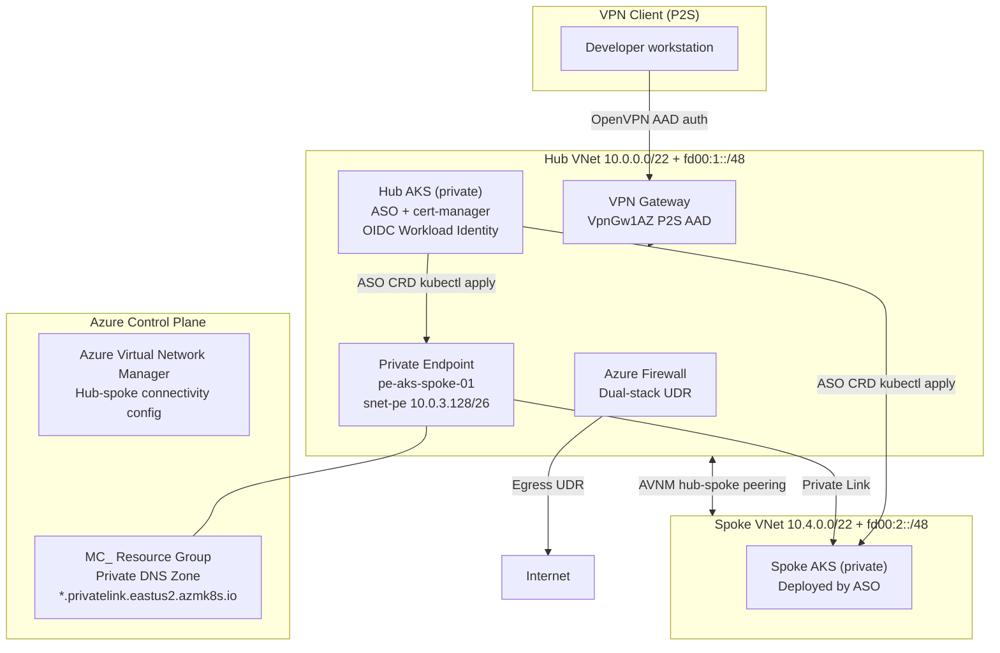

# Azure Hub-Spoke with ASO, AVNM, and Private AKS

A reference implementation that demonstrates using
[Azure Service Operator (ASO)](https://azure.github.io/azure-service-operator/) to
manage Azure resources declaratively from Kubernetes, deployed in a private
hub-spoke topology secured by Azure Firewall and reachable via P2S VPN.

## Architecture



## Two-phase deployment

The project is split into two phases because **Terraform Phase 1 provisions the
VPN Gateway** and you must connect via P2S before `kubectl` can reach the private
hub AKS API server required for Phase 2.

### Phase 1 – Core Infrastructure (Terraform)

`infra/` deploys all Azure resources:

| Resource | Description |
|---|---|
| Resource Groups | Hub + Spoke |
| Hub VNet (dual-stack) | `10.0.0.0/22` + `fd00:1::/48`, 5 subnets incl. `snet-pe` |
| Spoke VNet (dual-stack) | `10.4.0.0/22` + `fd00:2::/48` |
| AVNM | Hub-spoke connectivity config + deployment |
| Azure Firewall (Standard) | Dual-stack, UDR-forced egress for all AKS subnets |
| Firewall rules | FQDN tags for AKS, container registries, Azure services, NTP |
| Route tables | hub-aks, hub-mgmt, spoke-workload, **spoke-aks** (pre-created for ASO) |
| Hub AKS (private) | Azure CNI Overlay, dual-stack, OIDC, workload identity, UDR egress |
| ASO Azure prereqs | User-assigned managed identity + federated credential + Contributor RBAC |
| VPN Gateway | `VpnGw1AZ` Generation1, OpenVPN, Entra ID (AAD) P2S auth |

```bash
cd infra
cp terraform.tfvars.example terraform.tfvars
# Edit terraform.tfvars – fill in subscription_id, tenant_id, and any name overrides

terraform init
terraform plan -out=tfplan
terraform apply tfplan
```

> **Connect to VPN** before proceeding to Phase 2.
> Download the VPN client profile from the Azure Portal and add
> `dhcp-option DNS 168.63.129.16` to the `.ovpn` file so private DNS zones resolve.

### Phase 2 – Kubernetes + ASO Manifests

All steps require an active P2S VPN connection.  Apply them in order:

| Step | Directory | What it does |
|---|---|---|
| 1 | `manifests/01-cert-manager` | Installs cert-manager (ASO webhook dependency) |
| 2 | `manifests/02-aso` | Installs ASO v2 with workload identity auth |
| 3 | `manifests/03-spoke-cluster` | Deploys spoke AKS via ASO `ManagedCluster` CRD |
| 4 | `manifests/04-private-endpoint` | Creates PE + DNS zone group for spoke API server |

See the `README.md` in each sub-directory for exact commands.

## Prerequisites

| Tool | Version |
|---|---|
| [Azure CLI](https://learn.microsoft.com/cli/azure/install-azure-cli) | ≥ 2.55 |
| [Terraform](https://developer.hashicorp.com/terraform/install) | ≥ 1.5 |
| [kubectl](https://kubernetes.io/docs/tasks/tools/) | ≥ 1.28 |
| [Helm](https://helm.sh/docs/intro/install/) | ≥ 3.13 |
| P2S VPN client (OpenVPN or Azure VPN Client) | latest |

## Key design decisions

### Why AVNM instead of manual peering?
AVNM's connectivity configurations handle hub-spoke peering declaratively and scale
to many spokes without per-pair peering resources.

### Why ASO for the spoke cluster?
ASO lets you manage Azure resources with the same GitOps tooling you use for
Kubernetes workloads.  The spoke `ManagedCluster` manifest lives alongside the
application code that will run on it.

### Why pre-create the spoke route table in Terraform?
The spoke AKS cluster uses `outboundType: userDefinedRouting`, which requires the
route table to be associated with the subnet **before** the cluster is created.
Terraform Phase 1 creates and associates `rt-spoke-snet-aks`; ASO then deploys the
cluster into an already-egress-configured subnet.

### Why workload identity instead of a service principal secret?
No long-lived credentials.  The federated OIDC token exchange is handled
transparently by the Azure Workload Identity webhook – zero secrets in Kubernetes.

## Repository structure

```
.
├── infra/                          # Phase 1 – Terraform
│   ├── providers.tf
│   ├── variables.tf
│   ├── terraform.tfvars.example    # Copy to terraform.tfvars and populate
│   ├── resource_groups.tf
│   ├── networking.tf               # Hub + Spoke VNets, all subnets incl. snet-pe
│   ├── avnm.tf                     # AVNM hub-spoke connectivity
│   ├── firewall.tf                 # Azure Firewall + public IPs
│   ├── firewall_rules.tf           # Application + network rule collections
│   ├── routes.tf                   # Route tables for all AKS subnets
│   ├── aks.tf                      # Private hub AKS cluster
│   ├── aso.tf                      # Managed identity + federated cred + RBAC
│   ├── vpn_gateway.tf              # VPN Gateway P2S (Entra ID auth)
│   └── outputs.tf
│
└── manifests/                      # Phase 2 – Post-VPN Kubernetes / ASO
    ├── 01-cert-manager/            # Helm values + install README
    ├── 02-aso/                     # Helm values + install README
    ├── 03-spoke-cluster/           # ASO ManagedCluster CRD + README
    └── 04-private-endpoint/        # ASO PrivateEndpoint + DnsZoneGroup + README
```

## Contributing

Pull requests welcome.  Please open an issue first for significant changes.

## License

MIT
