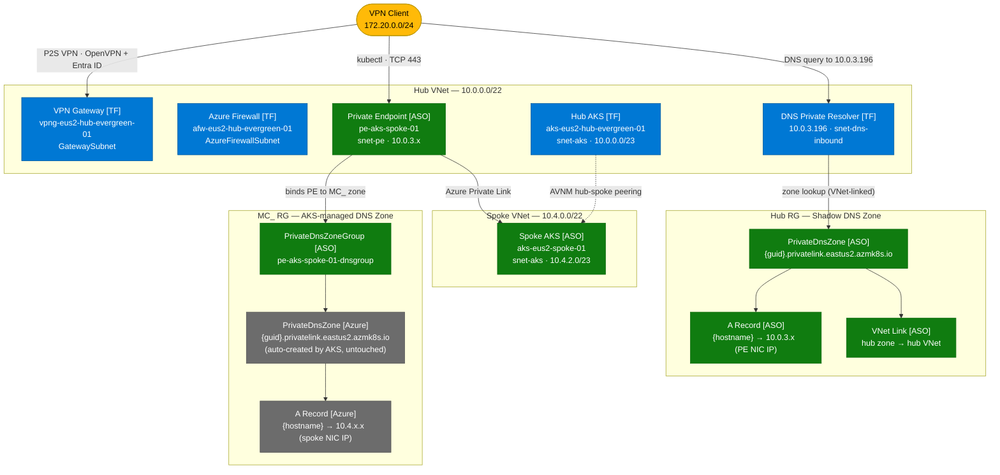

# Azure Hub-Spoke with ASO, AVNM, and Private AKS

A reference implementation of a private Azure hub-spoke network topology that uses
[Azure Service Operator (ASO)](https://azure.github.io/azure-service-operator/) to
manage Azure resources declaratively from Kubernetes. All infrastructure is deployed
via GitHub Actions with OIDC authentication and remote Terraform state.

---

## What gets deployed

### Phase 1 – Terraform (`infra/`)

| Resource | Name | Notes |
|---|---|---|
| Resource groups | `rg-eus2-hub-evergreen-01`, `rg-eus2-spoke-evergreen-01`, `rg-eus2-spoke-evergreen-02` | |
| Hub VNet (dual-stack) | `vnet-eus2-hub-evergreen-01` | `10.0.0.0/22` + `fd00:1::/48` |
| Hub subnets | `snet-aks`, `snet-pe`, `snet-dns-inbound`, `AzureFirewallSubnet`, `GatewaySubnet` | |
| Spoke VNet (dual-stack) | `vnet-eus2-spoke-evergreen-01` | `10.4.0.0/22` + `fd00:2::/48` |
| Spoke subnets | `snet-aks`, `snet-workload` | |
| Spoke-02 VNet (dual-stack) | `vnet-eus2-spoke-evergreen-02` | `10.8.0.0/22` + `fd00:3::/48`; BYO DNS variant |
| Spoke-02 subnets | `snet-aks`, `snet-workload` | |
| AVNM | `avnm-evergreen-01` | Hub-spoke connectivity config + deployment |
| Azure Firewall | `afw-eus2-hub-evergreen-01` | Standard, dual-stack, UDR egress |
| Firewall rules | App, network, and NAT rule collections | AKS, container registries, GitHub ARC, tooling |
| Route tables | `rt-hub-snet-aks`, `rt-spoke-snet-aks`, `rt-spoke-snet-workload`, `rt-spoke-02-snet-aks`, `rt-spoke-02-snet-workload` | All AKS subnets force-tunnel via firewall |
| DNS Private Resolver | `dnspr-eus2-hub-evergreen-01` | Inbound endpoint in `snet-dns-inbound` (`10.0.3.196`); pushed to P2S clients as DNS server |
| Hub AKS | `aks-eus2-hub-evergreen-01` | Private, dual-stack, Azure CNI Overlay, OIDC, workload identity |
| ASO managed identity | `mi-aso-hub` | Federated OIDC credential, Contributor on subscription |
| VPN Gateway | `vpng-eus2-hub-evergreen-01` | `VpnGw1AZ`, OpenVPN, Entra ID P2S auth, DNS pushed via `customDnsServers` (azapi) |

### Phase 2 – Kubernetes / ASO (`manifests/`)

| Step | What it does |
|---|---|
| `01-cert-manager` | Installs cert-manager (required by ASO webhook) |
| `02-aso` | Installs ASO v2 with workload identity auth via `mi-aso-hub` |
| `03-spoke-cluster` | Deploys `aks-eus2-spoke-01` via ASO `ManagedCluster` CRD |
| `04-private-endpoint` | Creates PE in `snet-pe`; creates a hub-owned shadow DNS zone with the spoke FQDN pointing to the PE NIC IP; links that zone to the hub VNet so VPN clients and hub workloads resolve to the PE without touching the AKS-managed MC_ zone |

---

## Architecture

> **Legend:** `[TF]` = Terraform (Phase 1) &nbsp;·&nbsp; `[ASO]` = Azure Service Operator / Kubernetes (Phase 2) &nbsp;·&nbsp; `[Azure]` = Azure-managed (not directly controlled)



**DNS resolution paths:**

| Caller | DNS server | Zone resolved | Returns |
|---|---|---|---|
| VPN client / hub workload | `10.0.3.196` (DNS Private Resolver) | Hub shadow zone (hub RG) | PE NIC IP `10.0.3.x` |
| Spoke pod | `168.63.129.16` (Azure DNS) | MC_ zone (auto-linked to spoke VNet) | Spoke NIC IP `10.4.x.x` |

The MC_ zone is never modified — AKS manages it exclusively. The hub shadow zone (same GUID-based name) is a separate resource in the hub RG, linked only to the hub VNet, and is owned entirely by ASO.

---

## Prerequisites

| Tool | Version |
|---|---|
| [Azure CLI](https://learn.microsoft.com/cli/azure/install-azure-cli) | ≥ 2.55 |
| [Terraform](https://developer.hashicorp.com/terraform/install) | ≥ 1.5 |
| [kubectl](https://kubernetes.io/docs/tasks/tools/) | ≥ 1.28 |
| [Helm](https://helm.sh/docs/intro/install/) | ≥ 3.13 |
| OpenVPN client or Azure VPN Client | latest |

---

## One-time setup (manual, do once)

### 1. Terraform remote state storage

```bash
az group create -n rg-eus2-evergreen-mgmt -l eastus2

az storage account create \
  --name sttfstatevsaz01 \
  --resource-group rg-eus2-evergreen-mgmt \
  --sku Standard_LRS \
  --allow-blob-public-access false \
  --min-tls-version TLS1_2

az storage container create \
  --name tfstate \
  --account-name sttfstatevsaz01
```

### 2. GitHub Actions managed identity + OIDC

```bash
# Create the managed identity
az identity create \
  --name mi-github-actions \
  --resource-group rg-eus2-evergreen-mgmt

MI_CLIENT_ID=$(az identity show \
  --name mi-github-actions \
  --resource-group rg-eus2-evergreen-mgmt \
  --query clientId -o tsv)

MI_PRINCIPAL_ID=$(az identity show \
  --name mi-github-actions \
  --resource-group rg-eus2-evergreen-mgmt \
  --query principalId -o tsv)

SUB_ID=$(az account show --query id -o tsv)

# Contributor on the subscription (for Terraform to create all resources)
az role assignment create \
  --assignee-object-id "$MI_PRINCIPAL_ID" \
  --assignee-principal-type ServicePrincipal \
  --role Contributor \
  --scope "/subscriptions/$SUB_ID"

# Storage Blob Data Contributor on the state account
az role assignment create \
  --assignee-object-id "$MI_PRINCIPAL_ID" \
  --assignee-principal-type ServicePrincipal \
  --role "Storage Blob Data Contributor" \
  --scope "$(az storage account show --name sttfstatevsaz01 --resource-group rg-eus2-evergreen-mgmt --query id -o tsv)"
```

### 3. Federated credentials for OIDC

```bash
REPO="just1nsanabria/az-vizio-evergreen-aso-pe"

# For push/workflow_dispatch on main branch
az identity federated-credential create \
  --name fc-gh-main \
  --identity-name mi-github-actions \
  --resource-group rg-eus2-evergreen-mgmt \
  --issuer "https://token.actions.githubusercontent.com" \
  --subject "repo:${REPO}:ref:refs/heads/main" \
  --audiences "api://AzureADTokenExchange"

# For the production environment (approval gate)
az identity federated-credential create \
  --name fc-gh-production \
  --identity-name mi-github-actions \
  --resource-group rg-eus2-evergreen-mgmt \
  --issuer "https://token.actions.githubusercontent.com" \
  --subject "repo:${REPO}:environment:production" \
  --audiences "api://AzureADTokenExchange"
```

### 4. GitHub repository secrets

Go to **Settings → Secrets and variables → Actions** and create:

| Secret | Value |
|---|---|
| `AZURE_CLIENT_ID` | Client ID of `mi-github-actions` (from `$MI_CLIENT_ID` above) |
| `AZURE_TENANT_ID` | Your Azure tenant ID |
| `AZURE_SUBSCRIPTION_ID` | Your subscription ID |
| `TF_VARS` | Full contents of `terraform.tfvars` (see format below) |

**`TF_VARS` format** — paste the entire block as the secret value, substituting real values:

```hcl
subscription_id = "<subscription-id>"
tenant_id       = "<tenant-id>"
location        = "eastus2"

hub_rg_name    = "rg-eus2-hub-evergreen-01"
spoke_rg_name  = "rg-eus2-spoke-evergreen-01"
spoke2_rg_name = "rg-eus2-spoke-evergreen-02"

hub_vnet_name             = "vnet-eus2-hub-evergreen-01"
hub_vnet_address_space    = ["10.0.0.0/22", "fd00:1::/48"]
hub_aks_subnet_name       = "snet-aks"
hub_aks_subnet_prefix     = "10.0.0.0/23"
hub_aks_subnet_prefix_v6  = "fd00:1::/64"

hub_fw_subnet_prefix    = "10.0.3.0/26"
hub_fw_subnet_prefix_v6 = "fd00:1:0:3::/64"
firewall_private_ip_v6  = "fd00:1:0:3::4"

hub_gw_subnet_prefix = "10.0.3.64/26"
hub_pe_subnet_name   = "snet-pe"
hub_pe_subnet_prefix = "10.0.3.128/26"

spoke_vnet_name                 = "vnet-eus2-spoke-evergreen-01"
spoke_vnet_address_space        = ["10.4.0.0/22", "fd00:2::/48"]
spoke_workload_subnet_name      = "snet-workload"
spoke_workload_subnet_prefix    = "10.4.0.0/23"
spoke_workload_subnet_prefix_v6 = "fd00:2::/64"
spoke_aks_subnet_name           = "snet-aks"
spoke_aks_subnet_prefix         = "10.4.2.0/23"
spoke_aks_subnet_prefix_v6      = "fd00:2:0:1::/64"

spoke2_vnet_name                 = "vnet-eus2-spoke-evergreen-02"
spoke2_vnet_address_space        = ["10.8.0.0/22", "fd00:3::/48"]
spoke2_workload_subnet_name      = "snet-workload"
spoke2_workload_subnet_prefix    = "10.8.0.0/23"
spoke2_workload_subnet_prefix_v6 = "fd00:3::/64"
spoke2_aks_subnet_name           = "snet-aks"
spoke2_aks_subnet_prefix         = "10.8.2.0/23"
spoke2_aks_subnet_prefix_v6      = "fd00:3:0:1::/64"

avnm_name                     = "avnm-evergreen-01"
avnm_ng_hub_name              = "ng-hub"
avnm_ng_spokes_name           = "ng-spokes"
avnm_connectivity_config_name = "cc-hub-spoke"

aks_name               = "aks-eus2-hub-evergreen-01"
aks_dns_prefix         = "aks-eus2-hub-evergreen"
aks_node_count         = 3
aks_node_vm_size       = "Standard_D4s_v3"
aks_kubernetes_version = null

aks_pod_cidr_v4     = "192.168.0.0/16"
aks_pod_cidr_v6     = "fd00:10::/112"
aks_service_cidr_v4 = "172.16.0.0/16"
aks_service_cidr_v6 = "fd00:11::/108"
aks_dns_service_ip  = "172.16.0.10"

firewall_name        = "afw-eus2-hub-evergreen-01"
firewall_sku_tier    = "Standard"
firewall_pip_name    = "pip-afw-eus2-hub-evergreen-01-v4"
firewall_pip_v6_name = "pip-afw-eus2-hub-evergreen-01-v6"

hub_aks_rt_name         = "rt-hub-snet-aks"
spoke_workload_rt_name  = "rt-spoke-snet-workload"
spoke_aks_rt_name       = "rt-spoke-snet-aks"
spoke2_workload_rt_name = "rt-spoke-02-snet-workload"
spoke2_aks_rt_name      = "rt-spoke-02-snet-aks"

aso_identity_name = "mi-aso-hub"
aso_namespace     = "azureserviceoperator-system"

vpn_gateway_name        = "vpng-eus2-hub-evergreen-01"
vpn_gateway_pip_name    = "pip-vpng-eus2-hub-evergreen-01"
vpn_gateway_sku         = "VpnGw1AZ"
vpn_client_address_pool = "172.20.0.0/24"

dns_resolver_name             = "dnspr-eus2-hub-evergreen-01"
hub_dns_inbound_subnet_prefix = "10.0.3.192/28"
```

### 5. GitHub Actions environment (approval gate)

Go to **Settings → Environments → New environment**, name it `production`, and add yourself as a required reviewer. Both the infra and manifests workflows gate apply/deploy steps behind this environment.

---

## Deployment

### Phase 1 — Trigger GitHub Actions

Push any change to `infra/**` or `main` branch, or manually dispatch:

**Actions → Phase 1 – Terraform Infrastructure → Run workflow → action: `apply`**

The Plan job runs first (no approval needed). The Apply job then waits for a `production` environment approval before executing.

> VPN Gateway takes ~45 minutes to provision — this is normal.

### Phase 2 — Connect VPN, install ARC, then deploy manifests

#### Step A — Connect P2S VPN

1. In the Azure Portal, navigate to `vpng-eus2-hub-evergreen-01` → **Point-to-site configuration** → **Download VPN client**.
2. Import the profile into the **Azure VPN Client** (`AzureVPN/azurevpnconfig.xml`) and connect using your Entra ID credentials.
   > The DNS Private Resolver inbound endpoint IP (`10.0.3.196`) is automatically pushed to all P2S clients as a DNS server — no manual profile edits are required. Both the hub and spoke private DNS zones resolve correctly over the tunnel.
3. Verify connectivity:
   ```bash
   az aks get-credentials \
     --resource-group rg-eus2-hub-evergreen-01 \
     --name aks-eus2-hub-evergreen-01 \
     --overwrite-existing
   kubectl get nodes
   ```

#### Step B — Install Actions Runner Controller (ARC)

The Phase 2 workflow runs on a self-hosted runner inside hub AKS so it can reach the private API server. Install ARC once after the VPN is connected:

```bash
# Install the ARC controller
helm install arc \
  --namespace arc-systems \
  --create-namespace \
  oci://ghcr.io/actions/actions-runner-controller-charts/gha-runner-scale-set-controller

# Install the runner scale set
# Create a GitHub PAT with repo + workflow scopes first
helm install arc-runner-set \
  --namespace arc-runners \
  --create-namespace \
  --set githubConfigUrl="https://github.com/just1nsanabria/az-vizio-evergreen-aso-pe" \
  --set githubConfigSecret.github_token="<github-pat>" \
  oci://ghcr.io/actions/actions-runner-controller-charts/gha-runner-scale-set

# Verify
kubectl -n arc-systems get pods
# Expected: arc-gha-rs-controller-... Running
#           arc-runner-set-...-listener Running
```

#### Step C — Deploy manifests via GitHub Actions

Trigger each step individually in order:

**Actions → Phase 2 – Kubernetes Manifests (ASO) → Run workflow**

| Run | Step input | What happens |
|---|---|---|
| 1 | `01-cert-manager` | Installs cert-manager in hub AKS |
| 2 | `02-aso` | Installs ASO, waits for pods Ready |
| 3 | `03-spoke-cluster` | Applies `ManagedCluster` CRD, waits up to 20 min for spoke AKS Ready |
| 4 | `04-private-endpoint` | Creates PE in `snet-pe`, links spoke DNS zone to hub VNet via ASO |

Each run requires `production` environment approval before executing.

---

## Connecting to the spoke cluster (after Phase 2)

The spoke API server is reached through the private endpoint in hub `snet-pe`. Step 04 sets up a **hub-owned shadow DNS zone** (same GUID-based name as the AKS-managed MC_ zone) linked only to the hub VNet, with an A record pointing to the PE NIC IP. This means:

| Client | Resolves to | Path |
|---|---|---|
| VPN client / hub workload | PE NIC IP (`10.0.3.x`) | Hub DNS resolver → hub zone → PE → spoke management plane |
| Spoke pod | Spoke NIC IP (`10.4.x.x`) | MC_ zone (untouched, auto-linked by AKS) → direct |

Connect via VPN first, then:

```bash
az aks get-credentials \
  --resource-group rg-eus2-spoke-evergreen-01 \
  --name aks-eus2-spoke-01 \
  --overwrite-existing

kubectl get nodes
```

Verify DNS resolves to the PE NIC (not the spoke-internal NIC):

```bash
# Should return 10.0.3.x
nslookup $(az aks show -g rg-eus2-spoke-evergreen-01 -n aks-eus2-spoke-01 --query privateFqdn -o tsv) 10.0.3.196
```

---

## Repository structure

```
.
├── .github/
│   └── workflows/
│       ├── infra.yml        # Phase 1 – Terraform Plan + Apply (ubuntu-latest)
│       └── manifests.yml    # Phase 2 – Kubernetes manifests (arc-runner-set)
│
├── infra/                   # Terraform – all Azure infrastructure
│   ├── providers.tf         # azurerm + azapi providers, remote state backend
│   ├── variables.tf
│   ├── terraform.tfvars.example
│   ├── resource_groups.tf
│   ├── networking.tf        # Hub + Spoke VNets and all subnets
│   ├── avnm.tf              # AVNM hub-spoke connectivity config
│   ├── firewall.tf          # Azure Firewall + dual-stack public IPs
│   ├── firewall_rules.tf    # Application + network rule collections
│   ├── routes.tf            # Route tables (all AKS subnets force-tunnel via firewall)
│   ├── dns_resolver.tf      # Azure DNS Private Resolver + inbound endpoint
│   ├── aks.tf               # Private hub AKS cluster
│   ├── aso.tf               # ASO managed identity + federated credential
│   ├── vpn_gateway.tf       # P2S VPN Gateway + azapi DNS server patch
│   └── outputs.tf
│
└── manifests/               # Kubernetes / ASO manifests (applied by Phase 2)
    ├── 01-cert-manager/     # cert-manager Helm values
    ├── 02-aso/              # ASO Helm values (identity rendered at runtime)
    ├── 03-spoke-cluster/    # ASO ManagedCluster for spoke AKS
    ├── 03.1-spoke-cluster-byodns/  # ASO ManagedCluster for spoke-02 (BYO DNS)
    ├── 04-private-endpoint/ # PE + hub shadow DNS zone + A record + VNet link
    │   ├── private-endpoint.yaml   # PrivateEndpoint in hub snet-pe
    │   ├── dns-zonegroup.yaml      # PrivateEndpointsPrivateDnsZoneGroup
    │   ├── dns-zone.yaml           # Hub-owned PrivateDnsZone (shadow of MC_ zone)
    │   ├── dns-a-record.yaml       # A record → PE NIC IP in hub zone
    │   └── dns-vnetlink.yaml       # VNet link: hub zone → hub VNet
    └── 04.1-private-endpoint-byodns/  # PE + DNS A record for spoke-02 (BYO DNS)
```

---

## Key design decisions

**AVNM instead of manual peering** — Declarative hub-spoke connectivity that scales to many spokes without per-pair peering resources.

**ASO for spoke cluster and network resources** — Spoke AKS and its private endpoint, DNS zone, and DNS records are managed via Kubernetes CRDs, keeping Azure resource management alongside application manifests in the same GitOps workflow.

**Pre-create spoke route table in Terraform** — The spoke AKS uses `outboundType: userDefinedRouting`. The route table must be associated with the subnet before cluster creation; Terraform Phase 1 handles this so ASO can deploy the cluster without needing extra RBAC.

**Workload identity for ASO** — No long-lived secrets. The federated OIDC token exchange is handled by the Azure Workload Identity webhook on the hub AKS.

**Hub-owned shadow DNS zone for spoke access** — Step 04 creates a private DNS zone in the hub RG with the same GUID-based name as the AKS-managed MC_ zone, linked only to the hub VNet, with an A record pointing to the PE NIC IP. The AKS-managed MC_ zone (linked only to the spoke VNet) is never modified. Each VNet resolves the spoke FQDN to the IP that is correct for its network path, with no DNS split-brain or hairpin routing.

**DNS Private Resolver instead of manual `.ovpn` edits** — Azure's `168.63.129.16` wire IP is not reachable by P2S VPN clients. An Azure DNS Private Resolver with an inbound endpoint in `snet-dns-inbound` provides a real hub VNet IP (`10.0.3.196`) that the VPN gateway pushes to clients automatically via `customDnsServers` (set via the `azapi` provider, which exposes properties not yet in the `azurerm` schema).

**Private endpoint in hub `snet-pe` for spoke access** — Hub-resident clients (`kubectl`, ARC runner, VPN users) reach the spoke API server through a PE NIC in the hub VNet via Azure Private Link.

---

## License

MIT


